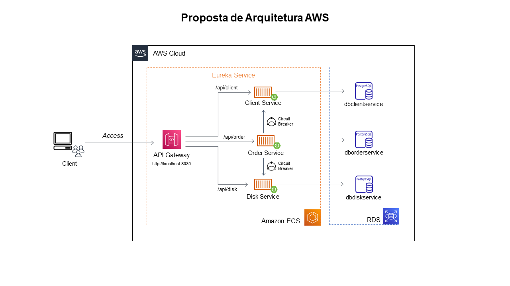
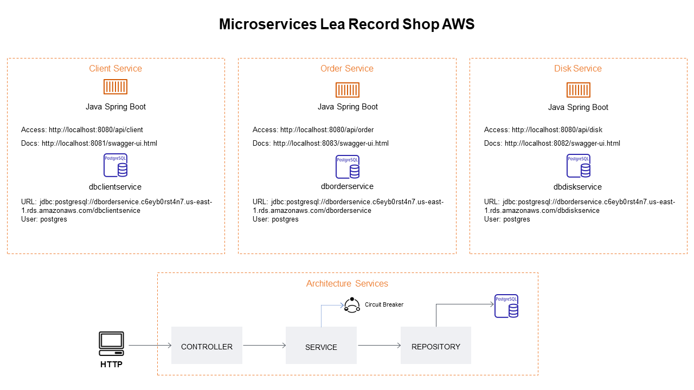

# Arquitetura de Microserviços com Spring boot - Record Microservices

<!---Esses são exemplos. Veja https://shields.io para outras pessoas ou para personalizar este conjunto de escudos. Você pode querer incluir dependências, status do projeto e informações de licença aqui--->



> Essa aplicação demonstra uma solução de uma loja de disco implementada por meio da arquitetura de microserviços com Java Spring Boot, JPA, Eureka Server, API Gateway, Database Postgres(RDS), Swagger and Resilience4j.

### Ajustes e melhorias

Abaixo algumas melhorias que serão desenvolvidas nas próximas sprints:

- [x] API Gateway
- [ ] Logging
- [ ] Security
- [ ] CD (Docker/Jenkins)
- [ ] SPA FrontEnd - Angular
- [ ] Run full AWS

## 💻 Pré-requisitos

Antes de começar, verifique se você atendeu aos seguintes requisitos:
<!---Estes são apenas requisitos de exemplo. Adicionar, duplicar ou remover conforme necessário--->
* Possui `Maven 3.2+` instalado;
* `JDK 6+` instalado;
* Conexão com a Internet, para que o Maven descarregue as dependências;
* O IDE de sua preferência (Utilizada  `IntelliJ`);

## 🚀 Instalando record-microservices

Para instalar o record-microservices, siga estas etapas.
Após realizar o download, descompacte-o e execute:

Linux e Windows:
```
cd record-microservices
```
Acessar cada um dos microserviços e executar:

`Client Service`
`Disk Service`
`Order Service`
`Api Gateway`
`Discovery Server`
```
mvn spring-boot:run
```

## ☕ Usando record-microservices



Depois que os miicroserviços forem iniciados, você poderá usá-lo por meio da interface do `Swagger` ou via `Postman`.

Para usar record-microservices, siga estas etapas:

* `Client Service` - `http://localhost:8081/swagger-ui.html`
* `Disk Service` - `http://localhost:8082/swagger-ui.html`
* `Order Service` - `http://localhost:8083/swagger-ui.html`

Importar os arquivos abaixo no `Postman` e executar as consultas.

* `Client Service` - <a href="docs/postman/Client Service.postman_collection.json">Client Service Postman Collection</a>
* `Disk Service` - <a href="docs/postman/Disk service.postman_collection.json">Disk Service Postman Collection</a>
* `Order Service` - <a href="docs/postman/Order Service.postman_collection.json">Order Service Postman Collection</a>

## 📫 Contribuindo para record-microservices
<!---Se o seu README for longo ou se você tiver algum processo ou etapas específicas que deseja que os contribuidores sigam, considere a criação de um arquivo CONTRIBUTING.md separado--->
Para contribuir com record-microservices, siga estas etapas:

1. Bifurque este repositório.
2. Crie um branch: `git checkout -b <nome_branch>`.
3. Faça suas alterações e confirme-as: `git commit -m '<mensagem_commit>'`
4. Envie para o branch original: `git push origin <nome_do_projeto> / <local>`
5. Crie a solicitação de pull.

Como alternativa, consulte a documentação do GitHub em [como criar uma solicitação pull](https://help.github.com/en/github/collaborating-with-issues-and-pull-requests/creating-a-pull-request).

[⬆ Voltar ao topo](#record-microservices)<br>
